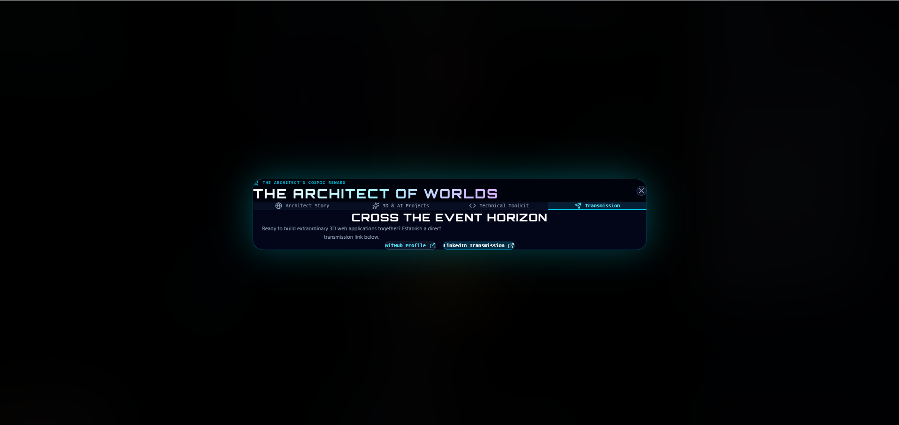

<div align="center">

# 🌌 The Architect of Worlds
### A Cinematic Interactive 3D Universe Experience

*Every world begins with an idea. Explore handcrafted planets inside a cosmic workshop built for the browser.*

[](https://nextjs.org/)
[](https://reactjs.org/)
[](https://threejs.org/)
[](https://www.typescriptlang.org/)
[](https://tailwindcss.com/)
[](https://openai.com/)
[]()
[]()
[]()


</div>

---

## 🏆 Hackathon Submission

**Event:** 3D Websites Hackathon  
**Theme:** Creative & Immersive 3D Web Experiences  
**Project:** The Architect of Worlds

## ✨ Highlights

- 🌌 **Cinematic 3D universe** rendered in-browser with React Three Fiber and Three.js.
- 🪐 **Interactive handcrafted worlds** built with custom shader materials and animated scene elements.
- 🤖 **Nova assistant** streams contextual responses through the Vercel AI SDK and an OpenAI-compatible provider.
- 🎮 **Story-driven exploration** combines a WebGL scene, planet lore, UI overlays, and portfolio content.
- ⚡ **Next.js App Router architecture** with Zustand state, dynamic canvas loading, and responsive quality settings.

---

## 📸 Screenshot Gallery

### The Universe

The Architect Universe - Overview of the browser-rendered 3D universe, central Nexus, planets, and HUD layers.


The Nexus - A handcrafted central world using emissive materials, orbiting elements, and cinematic lighting.

### 🪐 Realms of the Architect

Forge Planet - A volcanic world with lava-inspired shader work and interaction hooks.


Ocean World - A water-themed realm with animated visual treatment and exploration UI.


Crystal Moon - A crystalline moon focused on refraction-style visuals and skill-oriented lore.


Singularity - A dark contact-themed destination framed around gravity, messaging, and final navigation.


Terra Earth - A green living-world scene representing organic identity and portfolio storytelling.

### The Galactic Garden (Portfolio)

Galactic Garden - The alternate portfolio mode with stylized alien flora and garden-specific UI.


Galactic Garden Full View - A wider look at the floating garden scene and planted ecosystem.


Void Willow Sprout - One of the garden plant species used to represent portfolio content.


Nebula Orb Tendril - A garden flora variant with glowing organic forms.

### Nova AI & Interfaces

Universal Guide Nova - The chat interface for contextual AI guidance.


Architect Story - A narrative UI panel layered over the WebGL experience.


3D & AI Project - Interface content connecting the 3D scene with AI-assisted exploration.


Technical Toolkit - Portfolio-oriented UI showing technical capabilities inside the experience.


Transmission - A communication-themed interface state connected to the Singularity/contact concept.

---

## 📖 About

**What is The Architect of Worlds?**  
The Architect of Worlds is an interactive 3D WebGL portfolio experience built with Next.js, React Three Fiber, Three.js, and TypeScript. It presents a set of handcrafted planets, animated space effects, UI overlays, and an alternate Galactic Garden view inside a full-screen browser scene.

**Why was it built?**  
It was built to explore how a portfolio can feel more like a navigable world than a conventional page. The project uses real-time WebGL rendering, shader-based materials, camera transitions, and browser audio instead of pre-rendered video or plugins.

**What inspired it?**  
The project is influenced by deep-space exploration, science-fiction interface design, ambient game menus, NASA-style cosmic visualizations, and polished product-presentation pacing. These references shaped the tone, camera motion, celestial subjects, and layered HUD design.

**What experience does it create?**  
Users can move through a 3D universe, select planets from the navigator, inspect lore and telemetry panels, trigger world-specific interactions, open a Nova chat interface, and switch into a Galactic Garden portfolio mode.

---

## 💡 Inspiration

The project began with the idea of turning a personal portfolio into a small explorable cosmos, where each world could represent a different part of the creator's identity, technical background, or contact flow. Its visual direction reflects cinematic space imagery, science-fiction maps, and interface-heavy exploration games without trying to reproduce any single source.

Technically, it draws from the React Three Fiber and Three.js ecosystem: declarative scene composition, shader materials, post-processing, OrbitControls, and animated camera movement. The UI pacing is also influenced by product demos and cinematic onboarding sequences, where transitions and framing help guide attention.

---

## 🧩 Challenges

- Building a full-screen React Three Fiber scene that can coexist with layered React UI, modals, HUD panels, and pointer-event boundaries.
- Balancing visual detail with browser performance through dynamic quality tiers, reduced post-processing on low-tier devices, and point/instanced rendering patterns.
- Coordinating GSAP camera transitions with user-driven OrbitControls and global Zustand state.
- Keeping Nova's AI chat contextual to the currently selected object while routing requests through a server API.
- Designing the Galactic Garden as a separate view mode without duplicating the entire application shell.
- Organizing reusable world, environment, shader, audio, and UI components as the project grew.

---

## 🧠 Lessons Learned

- React Three Fiber works best here when scene responsibilities are split into focused components: camera, environment, worlds, effects, and UI-facing state.
- Shader-driven materials and emissive lighting can carry much of the visual identity without relying on large media files.
- Camera movement needs explicit state coordination; transitions, selected worlds, selected objects, and free navigation all compete for control.
- Browser audio should be initialized from user flow and kept adjustable through shared state.
- AI integration feels more coherent when the prompt includes local scene context instead of treating the assistant as a detached chat widget.
- Performance work is not a final pass; it shapes component boundaries, quality settings, rendering counts, and when effects are mounted.

---

## 🚀 Features

🟡 **Cinematic Intro / Loading** - `LoadingScreen`, `IntroSequence`, and camera intro state are implemented, though the store currently starts with instant access enabled.  
✅ **Interactive Universe** - Full-screen React Three Fiber canvas with Drei `OrbitControls` for rotate, zoom, and pan navigation.  
✅ **Handcrafted Worlds** - Six primary worlds are configured and rendered: Nexus, Terra Earth, Forge, Ocean, Crystal Moon, and Singularity. A secret planet component also exists.  
✅ **Dynamic Camera** - `CinematicCamera` uses GSAP timelines to move between overview, worlds, and discovered objects.  
✅ **Particle and Space Effects** - Procedural background stars, drifting dust, floating rocks, comets, nebula effects, and anomalies are implemented.  
✅ **Custom Shaders** - GLSL shader strings and shader materials support planet, lava, ocean, crystal, energy, nebula, and singularity visuals.  
✅ **Nova AI** - The chat route streams responses through the Vercel AI SDK using an OpenAI-compatible provider and scene context.  
✅ **Planet Exploration UI** - World detail panels, discovery HUD, timeline-style UI, search, labels, and lore/telemetry data are present.  
🟡 **Responsive UI / Quality Tiers** - Tailwind UI, viewport settings, reduced-motion/device capability hooks, and lower quality rendering paths are present; additional mobile control polish remains in progress.  
✅ **Procedural Audio** - Web Audio oscillators, filtered noise, navigation chimes, mute/volume state, and world-specific synth tones are implemented.  
🟡 **World Interactions** - Interaction components exist for each main world; continued polish is still tracked in the roadmap.  
🟡 **Galactic Garden Mode** - A separate garden scene, plant species data, garden HUD, stats, labels, and modal UI are implemented; continued polish remains in progress.  

---

## 🛠️ Tech Stack

| Domain | Technology | Role |
| :--- | :--- | :--- |
| **Framework** | Next.js 15 (App Router) | Core routing, root layout, and API endpoint structure |
| **Language** | TypeScript 5 | Typed components, config, stores, and data models |
| **Rendering** | React Three Fiber / Three.js | Declarative WebGL scene graph and custom 3D objects |
| **Post-Processing** | `@react-three/postprocessing` / `postprocessing` | Bloom, vignette, and chromatic aberration effects with quality-based mounting |
| **Animation** | GSAP / Framer Motion | Camera tweening and animated React UI overlays |
| **Styling** | Tailwind CSS 4 | Utility-based styling for HUDs, panels, overlays, and controls |
| **State** | Zustand | Global state for world selection, UI modes, audio, garden data, and camera targets |
| **AI** | Vercel AI SDK / OpenAI-compatible provider | Streaming completions for the Nova assistant |
| **Package Manager** | npm | Dependency resolution and scripts |

---

## 📁 Folder Structure

```text
src
|-- app
|   |-- api/chat/route.ts
|   |-- error.tsx
|   |-- globals.css
|   |-- layout.tsx
|   |-- loading.tsx
|   |-- not-found.tsx
|   `-- page.tsx
|-- components
|   |-- audio/
|   |-- camera/
|   |-- canvas/
|   |-- celestial/
|   |-- effects/
|   |-- environment/
|   |-- garden/
|   |-- interactive/
|   |-- shaders/
|   `-- ui/
|-- config
|   |-- camera.ts
|   `-- worlds.ts
|-- data
|   |-- gardenData.ts
|   `-- universe.json
|-- hooks
|   |-- useDeviceCapability.ts
|   |-- useReducedMotion.ts
|   `-- useWorldNavigation.ts
|-- lib
|   |-- openai.ts
|   |-- prompts.ts
|   `-- procedural/
|-- shaders
|   `-- custom GLSL string files
|-- stores
|   |-- useAudioStore.ts
|   |-- useGardenStore.ts
|   `-- useWorldStore.ts
|-- systems/
|-- types/
`-- utils/
```

---

## 🏛️ Architecture

* **App Router (`src/app`)**: Provides the root layout, global styles, error/loading/not-found states, the main page, and the `api/chat/route.ts` endpoint.
* **Scene Graph (`src/components/canvas/SceneContent.tsx`)**: Mounts the main Three.js scene, worlds, lighting, procedural background effects, post-processing, and the Galactic Garden view switch.
* **React Components (`src/components/ui`)**: DOM overlays layered over the canvas for navigation, HUDs, detail panels, chat, discovery logs, and toolbar controls.
* **State Management (`zustand`)**: Decouples selected worlds, selected objects, view mode, achievements, audio state, and UI flags from the WebGL canvas.
* **Three.js / Shaders (`src/shaders`)**: Reusable GLSL shader strings and materials for planetary surfaces, energy effects, nebulae, lava, ocean, crystal, and singularity visuals.
* **Nova API (`src/app/api/chat`)**: Uses the Vercel AI SDK to stream context-aware assistant responses from the server route.

---

## 🛤️ Project Walkthrough

1. **Landing**  
   The application mounts directly into a full-screen WebGL canvas. A loading overlay is displayed while the dynamically imported scene initializes.

2. **Universe Overview**  
   The camera frames a starfield, drifting dust, central Nexus, handcrafted worlds, and animated background elements. Users can rotate, pan, and zoom with OrbitControls.

3. **World Selection**  
   Using the **Grand World Navigator** top bar, the user selects a planet. The GSAP-controlled camera transitions toward the selected celestial body.

4. **Interaction & Deep Exploration**  
   Detail panels open with world-specific descriptions, metrics, discoveries, and interaction controls such as anvil, crystal, ruins, tree, constellation, and time-rewind concepts.

5. **Nova AI**  
   Opening Nova displays a conversational interface. The API route includes selected-object context so responses can reference the current world or object.

6. **Portfolio / Galactic Garden**  
   Entering Garden Mode switches from the universe scene to a stylized alien garden with plant species data, ecosystem stats, labels, and portfolio-oriented panels.

---

## 📊 Feature Status

| Feature | Status |
| :--- | :--- |
| **Interactive Universe** | Completed |
| **Custom Planet Shaders** | Completed |
| **GSAP Camera System** | Completed |
| **Nova AI Assistant** | Completed |
| **Deep Exploration UI** | Completed |
| **Procedural Audio** | Completed |
| **World Interactions** | In Progress |
| **Galactic Garden Mode** | In Progress |
| **Responsive Touch Polish** | In Progress |
| **Multiplayer Tracking** | Planned |
| **VR WebXR Support** | Planned |

---

## ⚡ Performance

Rendering a multi-world WebGL scene in the browser requires active optimization. The following systems are implemented:

* **Dynamic Canvas Loading**: The main `SceneCanvas` is dynamically imported from the Next.js page.
* **Point and Instanced Rendering**: Stars, dust, and floating rocks use point buffers or instanced meshes to keep repeated geometry efficient.
* **Quality Tiers**: `useDeviceCapability` detects mobile or lower-end renderers and passes a quality tier into the canvas.
* **Effect Scaling**: Nebula, comet, and post-processing intensity are reduced or skipped on lower quality tiers.
* **DPR Control**: Canvas device pixel ratio is capped differently for high, medium, and low quality settings.

---

## 🗺️ Roadmap

**✅ Completed**
- Next.js 15 and React Three Fiber base integration
- Handcrafted universe scene with procedural background stars, dust, and anomalies
- Six primary custom GLSL-themed worlds
- Cinematic GSAP camera navigation
- Nova AI streaming integration
- Deep exploration UI with lore, metrics, achievements, and discovery panels

**🔄 In Progress**
- Polishing world-specific interactions
- Tuning the procedural audio synthesis engine
- Mobile touch-controls polish
- Galactic Garden mode polish

**🔮 Future**
- VR WebXR support
- Multiplayer orbital tracking
- Expandable cosmic sectors using JSON/procedural data

---

## 💻 Local Development

**1. Install Dependencies**
```bash
npm install
```
*Installs the packages used by the Next.js, Three.js, React Three Fiber, Tailwind CSS, AI, animation, and state-management layers.*

**2. Start Development Server**
```bash
npm run dev
```
*Starts the Next.js development server with Turbopack. By default, the app is served at `http://localhost:3000`.*

**3. Build for Production**
```bash
npm run build
```
*Creates an optimized production build using Next.js.*

**4. Start Production Server**
```bash
npm start
```
*Runs the compiled production build locally.*

---

## 🔐 Environment Variables

The Nova assistant requires an API key. A `.env.example` file is provided in the repository.

Create a `.env.local` file and add the following:

```env
# Required for the Nova AI Assistant
OPENAI_API_KEY=your_openai_or_openrouter_api_key_here

# Optional: Override the base URL if using a service like OpenRouter
OPENAI_BASE_URL=https://openrouter.ai/api/v1
```

---

## 🤝 Contributing

Contributions are welcome from graphics programmers, UI engineers, and storytellers.

1. Fork the Project
2. Create your Feature Branch (`git checkout -b feature/AmazingFeature`)
3. Commit your Changes (`git commit -m 'Add some AmazingFeature'`)
4. Push to the Branch (`git push origin feature/AmazingFeature`)
5. Open a Pull Request

Please run `npm run build` before opening a PR. The current `npm run lint` script references `next lint`, which is not available in this Next.js version and may need to be updated before it can be used reliably.

---

## 📄 License

No standalone license file is currently included in this repository. Add a `LICENSE` file before distributing or accepting external contributions under a specific license.
